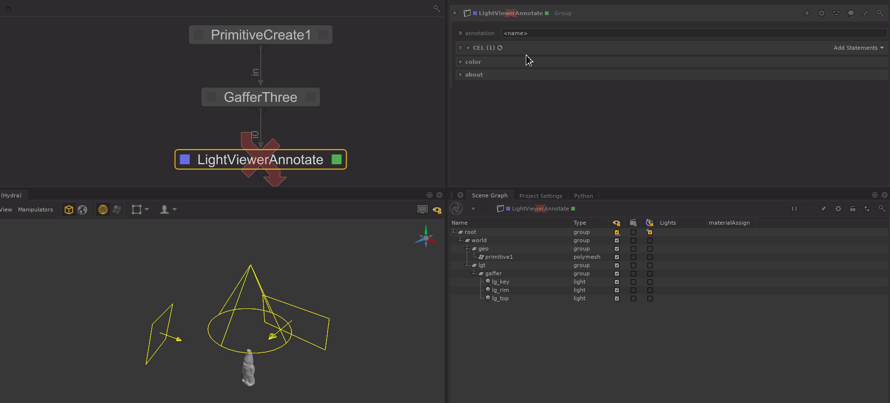

# Light Viewer Annotate


Annotate (& color) lights in the viewer using their attributes.

The annotation is generated based on token that will query the corresponding attributes on the light location.

For example `<name>_expo:<exposure>_samples:<samples>` would give
```
lg_test_expo:15.5_samples:2
```

It is possible to query the light color attribute to use them to color the light itself or its annotation.





The published script was made for Arnold, but it is possible to configure
it for any renderer.


## Installation

### .lua

Create a new OpScript node and copy/paste the content of the .lua script inside.
Follow the instructions on the top comment to setup the node.

### .xml

Copy the content of the [LightViewerAnnotate.node.xml](LightViewerAnnotate.node.xml)
file and paste it into the Katana Nodegraph.


### Integrating a new render-engine

All the modifications will be in the `Light` class (line 175)
Go down to line 234 we define the class attribute `attributes`:

This is a table where key=string, value=table. 

 - The key correspond to an arbitrary token name (without the `<>`)
 - The value must be a table with 2 fixed keys:
   	- func : function to execute that will return the value querried.
      	- params : table of arguments to pass to the above function (unpack() will be used)

You already have the most basic method created to query values : `get_attr`

You only need to pass the attribute location and a default value.

You can of course create any other method as long as it returns something 
(it will be converted later to string anyway)